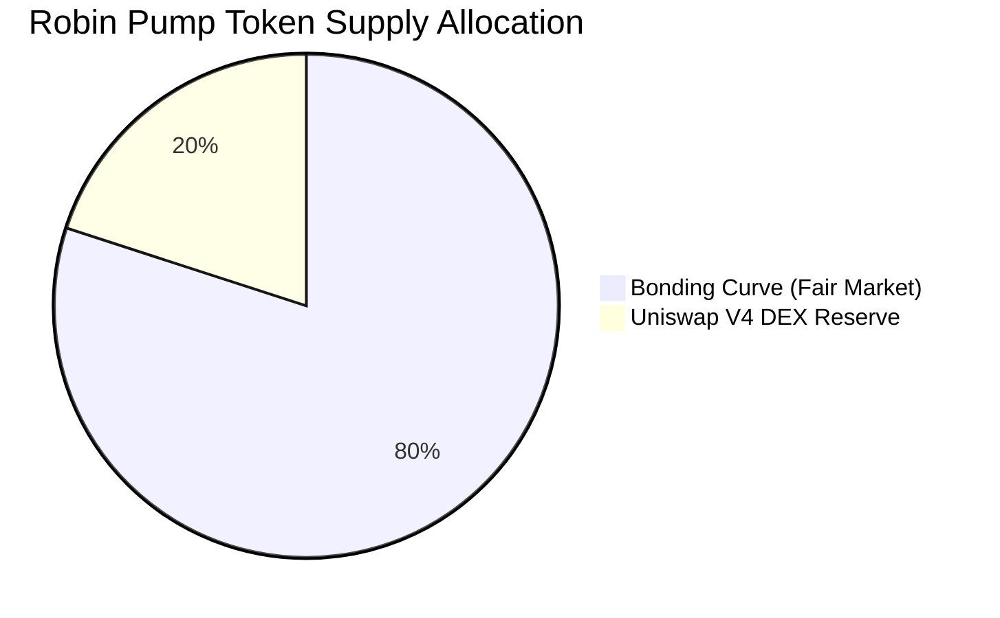
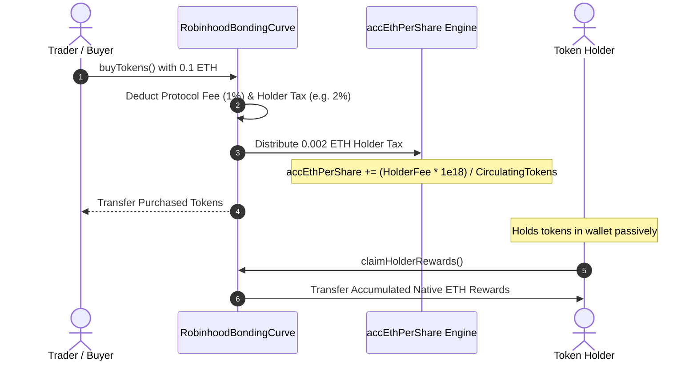
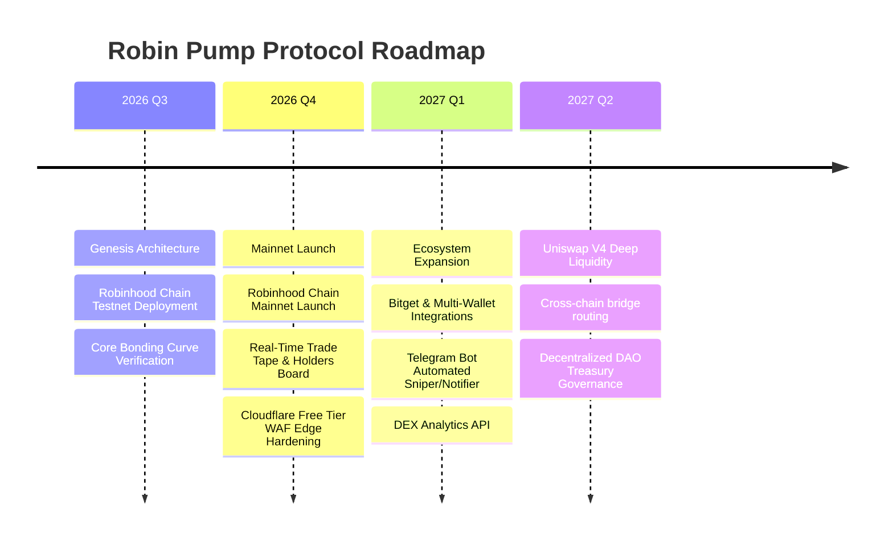

# Robin Pump: Decentralized Fair Launch Protocol & Autonomous AMM
## Technical Whitepaper — Version 1.0
**Network:** Robinhood Chain L2 (EVM / Arbitrum Nitro)  
**Date:** October 2026  
**Website:** [Robin Pump Launchpad](https://robinhood-launchpad.com)  
**GitHub:** [robinhood-launchpad](https://github.com/yogaajuz/robinhood-launchpad)  

---

## Executive Summary

The decentralized meme token ecosystem has long suffered from structural market failures: insider pre-mining, rug pulls through abrupt liquidity removal, sniper bot front-running, and extractive team allocations. **Robin Pump** is a decentralized, zero-privilege token fair launch protocol deployed on **Robinhood Chain L2**. 

Robin Pump introduces an autonomous dual-stage liquidity model:
1. **Stage 1 (Price Discovery):** A virtual constant-product bonding curve AMM that enables fair, non-custodial, and MEV-resistant price discovery until a verified **2.0 ETH** real liquidity milestone is achieved.
2. **Stage 2 (Permanent Graduation):** An atomic, permissionless migration to a **Uniswap V4 pool** governed by a custom Singleton Hook (`RobinhoodBondingCurveHook`), permanently locking liquidity and minting no LP tokens to creators or administrators.
3. **Native ETH Reflection Engine:** A real-time, zero-staking dividend system that distributes protocol trading fees to coin holders in native ETH directly through a MasterChef-style accumulator.

Every token launched through Robin Pump operates with a mathematically fixed supply of **1,000,000,000 (1 Billion) tokens**, zero developer allocations, and zero mint or blacklist capabilities.

---

```mermaid
flowchart TD
    subgraph Launch["Phase 1: Token Creation & Fair Launch"]
        Creator["Creator Launches Token"] -->|Zero Presale / Zero Pre-mine| Factory["RobinhoodTokenFactory"]
        Factory -->|Mints 1,000,000,000 Supply| Curve["RobinhoodBondingCurve"]
        Curve -->|800M Tokens (80%)| VAMM["Virtual Constant Product Curve (vETH = 0.5 ETH)"]
        Curve -->|200M Tokens (20%)| Escrow["Locked DEX Migration Escrow"]
    end

    subgraph Trading["Phase 2: Decentralized Bonding Curve Trading"]
        Traders["Traders (Buy / Sell)"] <-->|ETH <-> Token Swaps| VAMM
        VAMM -->|1% Protocol Fee| Treasury["Platform Treasury"]
        VAMM -->|Holder Tax in ETH| Reflection["Native ETH Reflection Accumulator"]
        Reflection -.->|Claim Anytime (No Staking)| Holders["Token Holders"]
        VAMM -->|Accumulated Real ETH| Reserve["Real ETH Reserve (0 -> 2.0 ETH)"]
    end

    subgraph Graduation["Phase 3: Uniswap V4 Migration Target (2.0 ETH)"]
        Reserve -->|Target Reached: 2.0 ETH| GradEvent["Atomic Permissionless Graduation"]
        GradEvent -->|0.02 ETH Creator Bounty| Creator
        GradEvent -->|1.98 ETH + 200M Reserved Tokens| V4Router["RobinhoodUniswapV4MigrationRouter"]
        V4Router -->|Full Range Pool + Singleton Hook| UniV4["Uniswap V4 Pool Manager"]
        UniV4 -->|LP Tokens Burned / Permanently Locked| BurntLP["Un-ruggable Eternal DEX Liquidity"]
    end
```

---

## 1. Introduction & Market Problem

### 1.1 The Pitfalls of Traditional Memecoin Launchpads
Decentralized token launches have historically been vulnerable to predatory tokenomics and smart contract vulnerabilities:
* **The Liquidity Drain ("Rug Pull"):** Creators deploy a token, supply initial liquidity to an AMM, attract capital, and subsequently pull their LP tokens, draining all investor capital.
* **Insider Pre-Mining:** Teams privately mint substantial proportions of supply (20–50%) prior to market opening, creating extreme sell pressure on secondary retail traders.
* **Malicious Bytecode:** Unaudited custom ERC-20 implementations frequently contain hidden minting functions, blacklists, transfer fee traps, or honeypot mechanics.
* **Broken Reflection Systems:** Traditional reflection tokens (e.g., SafeMoon-style) rely on gas-heavy loops or in-token transfer rebasing, which fail when integrating with modern concentrated-liquidity AMMs like Uniswap V3 and V4.

### 1.2 The Robinhood Chain Thesis
Robin Pump is built natively for **Robinhood Chain**, an EVM-compatible Arbitrum Nitro Layer 2 rollup. Robinhood Chain provides:
* **Sub-cent Transaction Fees:** Making micro-swaps, real-time reflection claims, and high-frequency trading commercially viable for retail participants.
* **Sub-second Block Finality:** Eliminating the extended mempool latency exploited by front-running bots on Layer 1 Ethereum.
* **Full EVM Compatibility:** Seamless integration with MetaMask, Bitget Wallet, Coinbase Wallet, and standard tooling (Ethers.js, Foundry).

---

## 2. Tokenomics & Supply Distribution

Every token launched through Robin Pump adheres to an immutable, non-configurable supply distribution:

| Allocation Category | Token Amount | Supply Percentage | Custody / Status |
| :--- | :---: | :---: | :--- |
| **Bonding Curve Reserve** | 800,000,000 | **80.0%** | Locked inside `RobinhoodBondingCurve` contract for open-market price discovery |
| **Uniswap V4 Liquidity** | 200,000,000 | **20.0%** | Escrowed for automatic pairing with 2.0 ETH upon graduation |
| **Team / Creator Pre-mine** | 0 | **0.0%** | Zero pre-allocation. Creators must buy from the public curve like all traders |
| **Private Presale** | 0 | **0.0%** | No private rounds or preferential pricing |
| **Total Supply** | **1,000,000,000** | **100.0%** | **Fixed & Capped Forever (No mint function)** |



---

## 3. Mathematical Model & Bonding Curve Mechanics

Robin Pump uses a **Virtual Constant-Product AMM** invariant to guarantee smooth price progression, instant liquidity at genesis, and continuous algorithmic price discovery without requiring initial seed capital from the creator.

### 3.1 The Virtual Invariant Equation
The curve operates on the invariant:
$$ (R_{ETH} + V_{ETH}) \times R_{Token} = K $$

Where:
* $R_{ETH}$: Real native ETH deposited into the curve by buyers ($0 \le R_{ETH} \le 2.0\text{ ETH}$).
* $V_{ETH}$: Virtual ETH reserve constant, initialized to **$0.5\text{ ETH}$** ($0.5 \times 10^{18}\text{ wei}$).
* $R_{Token}$: Token reserve available for purchase on the curve ($0 \le R_{Token} \le 800,000,000 \times 10^{18}\text{ wei}$).
* $K$: The invariant constant product, established at deployment:
$$ K = V_{ETH} \times R_{Token,0} = 0.5 \times 800,000,000 \times 10^{36} = 4.0 \times 10^{44} $$

### 3.2 Buying Formula (ETH $\to$ Token)
When a trader deposits $\Delta \text{ETH}_{in}$ native ETH:
1. Applicable protocol and community fees are deducted:
   $$ \text{Fee}_{total} = \Delta \text{ETH}_{in} \times \frac{\text{BPS}_{total}}{10000} $$
   $$ \Delta \text{ETH}_{net} = \Delta \text{ETH}_{in} - \text{Fee}_{total} $$
2. The new real ETH reserve is calculated:
   $$ R'_{ETH} = R_{ETH} + \Delta \text{ETH}_{net} $$
3. The new token reserve is computed via the invariant:
   $$ R'_{Token} = \frac{K}{V_{ETH} + R'_{ETH}} $$
4. The exact tokens delivered to the buyer $\Delta \text{Tokens}_{out}$ are:
   $$ \Delta \text{Tokens}_{out} = R_{Token} - R'_{Token} = R_{Token} - \frac{K}{(V_{ETH} + R_{ETH}) + \Delta \text{ETH}_{net}} $$

### 3.3 Selling Formula (Token $\to$ ETH)
When a trader sells $\Delta \text{Tokens}_{in}$ back to the curve:
1. The new token reserve is:
   $$ R'_{Token} = R_{Token} + \Delta \text{Tokens}_{in} $$
2. The gross ETH returned from the virtual reserve is:
   $$ \Delta \text{ETH}_{gross} = (V_{ETH} + R_{ETH}) - \frac{K}{R'_{Token}} $$
3. Net ETH transferred to the seller after fee deductions:
   $$ \Delta \text{ETH}_{net} = \Delta \text{ETH}_{gross} \times \left(1 - \frac{\text{BPS}_{total}}{10000}\right) $$

### 3.4 Spot Price & Market Capitalization
The marginal spot price $P(R_{ETH})$ (expressed in ETH per token) at any reserve level is given by the derivative of the curve:
$$ P(R_{ETH}) = \frac{d(R_{ETH})}{d(R_{Token})} = \frac{(V_{ETH} + R_{ETH})^2}{K} $$

* **Genesis Price ($R_{ETH} = 0$):**
  $$ P_0 = \frac{(0.5)^2}{4.0 \times 10^{8}} = 6.25 \times 10^{-10}\text{ ETH per token} $$
  Assuming $1\text{ ETH} \approx \$4,200\text{ USD}$, the initial token price is $\approx \$0.000002625\text{ USD}$, giving an initial market capitalization of $\approx \$2,625\text{ USD}$.
* **Graduation Price ($R_{ETH} = 2.0\text{ ETH}$):**
  $$ P_{grad} = \frac{(0.5 + 2.0)^2}{4.0 \times 10^{8}} = \frac{6.25}{4.0 \times 10^{8}} = 1.5625 \times 10^{-8}\text{ ETH per token} $$
  At graduation, the token price is $\approx \$0.00006563\text{ USD}$, resulting in a fully diluted market capitalization of **$\approx \$65,625\text{ USD}$**.

---

## 4. Native ETH Reflection Engine

Unlike legacy reflection tokens that manipulate token balances or charge exorbitant gas fees on secondary transfers, Robin Pump implements a **MasterChef-style Cumulative Dividend Accumulator** denominated entirely in **native ETH**.



### 4.1 Accumulator Mechanics
Whenever a buy or sell occurs on the curve with an active Holder Tax ($T_{holder} > 0$):
1. The circulating supply is determined:
   $$ S_{circulating} = S_{curve} - R_{Token} $$
2. The global cumulative reward per share is updated:
   $$ \text{accEthPerShare}_{t} = \text{accEthPerShare}_{t-1} + \frac{\text{HolderTaxAmount} \times 10^{18}}{S_{circulating}} $$
3. Whenever a user interacts with the curve, their reward debt is reconciled:
   $$ \text{RewardDebt}_u = \frac{\text{Balance}_u \times \text{accEthPerShare}}{10^{18}} $$

### 4.2 On-Demand Reward Claiming
Holders can call `claimHolderRewards()` at any time without selling or locking their tokens. The contract calculates:
$$ \text{Claimable}_u = \left( \frac{\text{Balance}_u \times \text{accEthPerShare}}{10^{18}} - \text{RewardDebt}_u \right) + \text{PendingRewards}_u $$
The reward is paid immediately in **pure native ETH**, avoiding extra token swap sell pressure.

---

## 5. Uniswap V4 Migration & Hook Integration

### 5.1 The 2.0 ETH Graduation Event
When the real ETH reserve reaches the target:
$$ R_{ETH} \ge 2.0\text{ ETH} $$
The bonding curve is marked as **Graduated** (`isGraduated = true`). Trading on the bonding curve is permanently disabled, and the migration routine executes atomically:
1. **Creator Bounty:** **0.02 ETH** is transferred directly to the coin creator wallet as a performance reward.
2. **Net Migration Capital:** The remaining **$1.98\text{ ETH}$** and the reserved **$200,000,000\text{ tokens}$** ($20\%$ supply) are transferred to the `RobinhoodUniswapV4MigrationRouter`.

### 5.2 Uniswap V4 Pool Deployment
The migration router interfaces with the canonical **Uniswap V4 Pool Manager** on Robinhood Chain:
* Initializes a full-range liquidity position for the pair `ETH / Token`.
* Attaches the protocol's Singleton Hook: [`RobinhoodBondingCurveHook`](file:///C:/Users/Ananda%20Yoga/.gemini/antigravity/scratch/robinhood-launchpad/contracts/RobinhoodBondingCurveHook.sol).
* **Permanent Liquidity Lock:** The LP position is permanently bound to the hook contract or burned. Neither the creator, Robin Pump administrators, nor any external entity can remove liquidity or pull funds.

### 5.3 Uniswap V4 Hook Architecture
The [`RobinhoodBondingCurveHook`](file:///C:/Users/Ananda%20Yoga/.gemini/antigravity/scratch/robinhood-launchpad/contracts/RobinhoodBondingCurveHook.sol) extends Uniswap V4 core features:
* **`beforeSwap`**: Enforces slippage control and validates pool integrity.
* **`afterSwap`**: Dynamically intercepts swap fees to preserve the creator royalty and native ETH reflection rewards even after the token has graduated to Uniswap V4.

---

## 6. Smart Contract Architecture

The Robin Pump smart contract ecosystem is written in Solidity `^0.8.20`, thoroughly tested with Foundry, and architected with strict separation of concerns:

```
contracts/
├── interfaces/
│   └── IERC20.sol                           # Standard ERC20 interface
├── RobinhoodToken.sol                        # Standard, un-ruggable ERC-20 token implementation
├── RobinhoodTokenFactory.sol                 # CREATE2 factory deploying curves and tokens
├── RobinhoodBondingCurve.sol                 # Core Virtual AMM, reflection, and graduation logic
├── RobinhoodBondingCurveHook.sol             # Uniswap V4 custom singleton lifecycle hook
└── RobinhoodUniswapV4MigrationRouter.sol     # Permissionless graduation router
```

### 6.1 `RobinhoodToken.sol`
* Implements standard OpenZeppelin ERC-20.
* **Zero Admin Functions:** No `mint()`, no `burn()`, no `freeze()`, and no `blacklist()`.
* Entire initial supply of 1,000,000,000 is minted once directly to the `RobinhoodBondingCurve` contract during initialization.

### 6.2 `RobinhoodBondingCurve.sol`
* Manages the virtual invariant math, user dividend balances, and slippage calculations.
* Incorporates OpenZeppelin's `ReentrancyGuard` across all state-changing entry points (`buyTokens`, `sellTokens`, `claimHolderRewards`).
* Enforces `require(creatorTaxBps + holderTaxBps <= 1000)` to ensure combined fees can never exceed a 10% maximum cap.

---

## 7. Protocol Security & Attack Vectors

| Attack Vector | Traditional Launchpad Risk | Robin Pump Countermeasure |
| :--- | :--- | :--- |
| **Rug Pull (LP Removal)** | Creator unlocks & withdraws LP tokens | LP tokens are permanently locked into Uniswap V4; no withdrawal pathway exists in the router |
| **Honeypot / Hidden Taxes** | Developer changes sell tax to 99% | Tax rates are **immutable** and capped at $\le 10\%$ in constructor |
| **Flash Loan Reentrancy** | Attacker re-enters contract during ETH transfer | Checks-Effects-Interactions pattern enforced; `nonReentrant` on all mutations |
| **Sniper Bot Front-Running** | Bots purchase large % in block 0 | Virtual curve depth ($0.5\text{ ETH}$) forces heavy price impact on large initial buys; atomic creator dev buy option |
| **Frontend Hijacking** | DNS poisoning or XSS script injection | Cloudflare Full (Strict) SSL, edge WAF custom rules, and isolated Apache `.htaccess` sandboxing |

---

## 8. Protocol Roadmap



---

## 9. Technical Parameters Quick Reference

| Parameter | Value | Specification |
| :--- | :---: | :--- |
| **Chain ID** | `4663` | Robinhood Chain Mainnet (EVM) |
| **Testnet Chain ID** | `46630` | Robinhood Chain Testnet |
| **Native Gas Currency** | `ETH` | 18 Decimals |
| **Total Token Supply** | `1,000,000,000` | Fixed supply (100%) |
| **Tokens on Curve** | `800,000,000` | 80% allocated to Bonding Curve |
| **Tokens for Uniswap V4**| `200,000,000` | 20% reserved for DEX Graduation |
| **Virtual ETH ($V_{ETH}$)**| `0.5 ETH` | Initial liquidity depth anchor |
| **Graduation Milestone** | `2.0 ETH` | Exact threshold to trigger Uniswap V4 pool |
| **Creator Graduation Bounty**| `0.02 ETH` | Performance reward paid to creator on graduation |
| **Protocol Trading Fee** | `1.00%` (100 bps) | Sent to platform treasury |
| **Max Configurable Tax** | `10.00%` (1000 bps) | Maximum creator + holder reflection tax limit |

---

## 10. Legal Disclaimer

*This whitepaper is intended for informational and technical documentation purposes only and does not constitute financial, investment, legal, or tax advice. Tokens launched through Robin Pump are community-driven decentralized cryptographic software assets designed for entertainment, utility, and experimental decentralized finance. Participation in cryptocurrency protocols involves significant risk of monetary loss. Robin Pump is fully non-custodial and operates autonomously on the Robinhood Chain decentralized ledger.*
